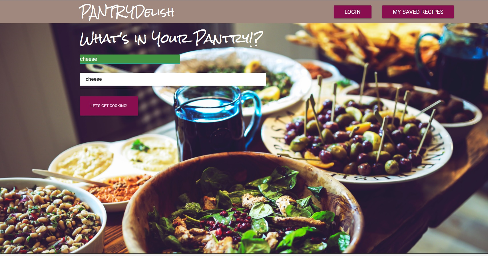

# PantryDelish
The pantry delish app helps hungry users find recipes from ingredients in their pantry. The app generates recipe cards and instructional videos based on the ingredients entered as input. An authenticated user can also save recipe cards in his account for future reference. 

##Contents
* [Technologies](#technologies)
* [Features](#features)
* [Installation](#install)

## <a name="technologies"></a>Technologies
Frontend: Firebase, JavaScript, jQuery, AJAX, Materialize, Bootstrap, HTML5, CSS<br/>
API: Spoonacular API, Youtube API<br/>

## <a name="features"></a>Features



Pantry Delish has a home page with a login for existing users to log in. New users can use the Sign up link on the login page to create an account<br>

Logged in users can save recipes to their accounts and the recipe link and image gets saved to Firebase database.<br>

All users can search for recipes and instructional videos by entering the ingredients thay have in their pantry on the Home page. <br>


## <a name="install"></a>Installation

To run PantryDelish:

Clone or fork this repo:

```
https://github.com/katliangPantryDelish.git
```
Sign up to use the [Spoonacular API](https://spoonacular.com/food-api).

Run the app:

Open index.html in the browser

